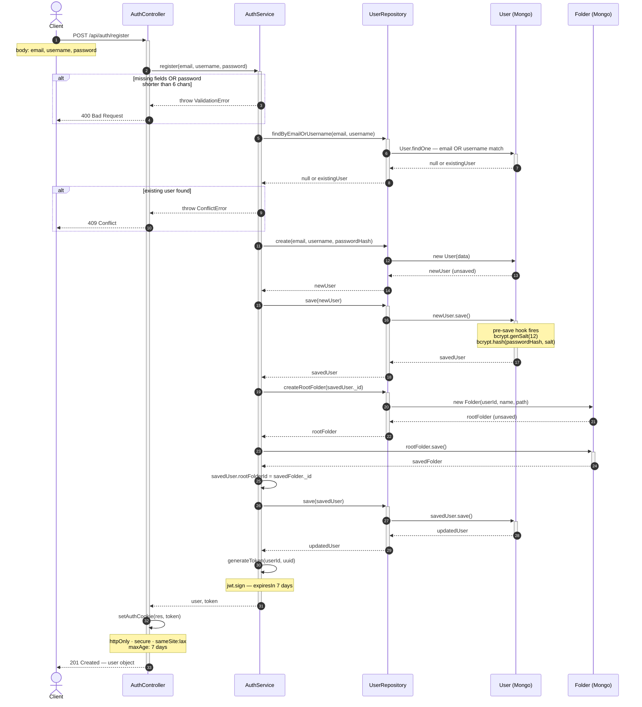
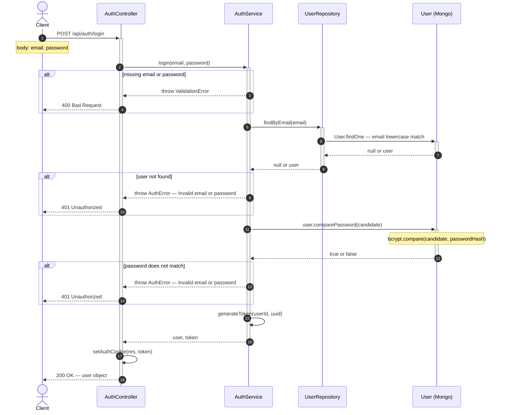
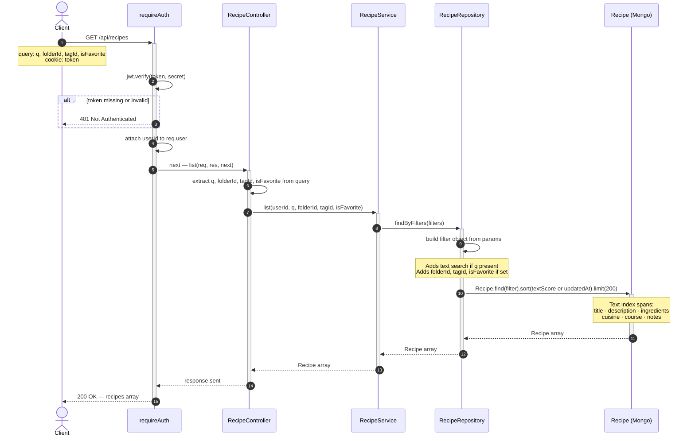
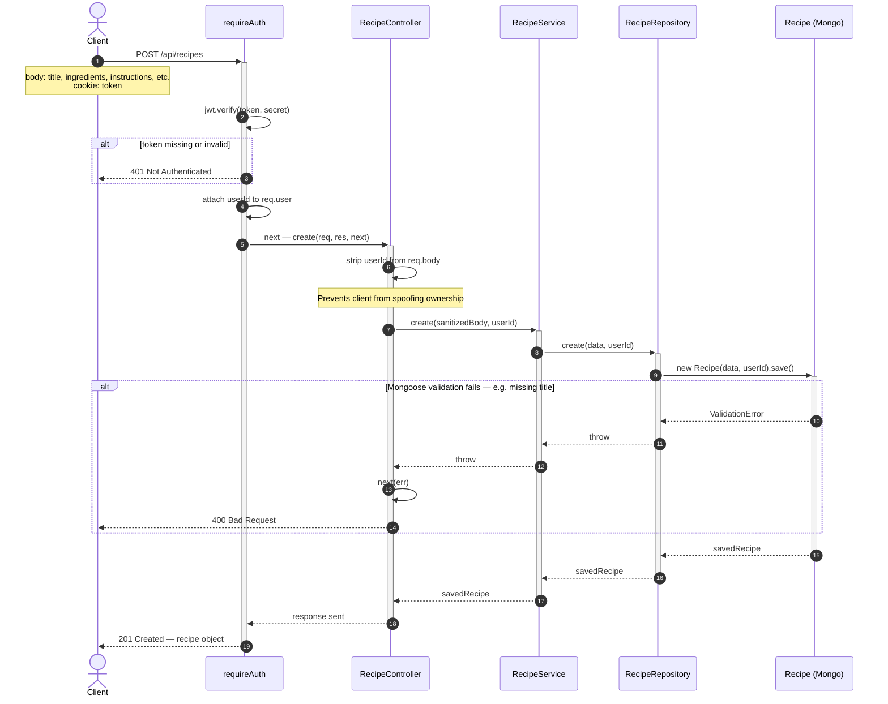
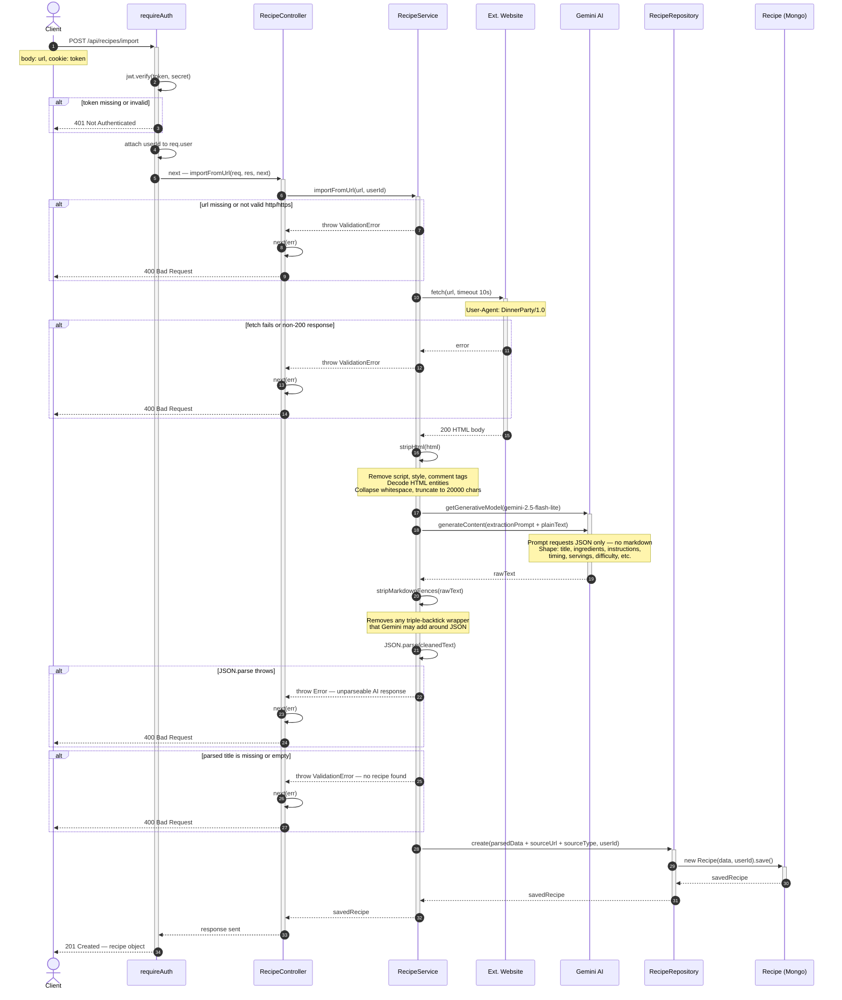

# DinnerParty — Sequence Diagrams

UML sequence diagrams showing use case realization across the system.
Solid arrows are calls; dashed arrows are returns. Steps are autonumbered.
`alt` blocks show branching paths (error vs. happy path).

---

## Use Case 1: User Registration

Spans 6 objects. Covers input validation, duplicate-user check, two sequential DB
writes (User then root Folder), a bcrypt password hash via Mongoose pre-save hook,
JWT generation, and HTTP-only cookie response.

---

## Use Case 2: User Login

Spans 4 objects. Covers field validation, user lookup by email, bcrypt password
comparison via a Mongoose instance method, and JWT cookie response.
Shows the authentication failure path.

---

## Use Case 3: List Recipes with Full-Text Search

Spans 6 objects. Covers JWT auth via middleware, query parameter extraction,
dynamic filter construction, MongoDB text-score sorting when a search term is
present, and response shaping.

---

## Use Case 4: Create Recipe (Manual Entry)

Spans 5 objects. Covers JWT auth, body sanitization (stripping any client-injected
userId to prevent spoofing), recipe construction, Mongoose validation, and persistence.

---

## Use Case 5: AI Recipe Import from URL

The most complex flow in the system — spans 7 objects including an external website
and the Gemini AI API. Covers JWT auth, URL validation, external page fetch, HTML
stripping, AI content extraction, JSON parsing with error recovery, and DB persistence.

