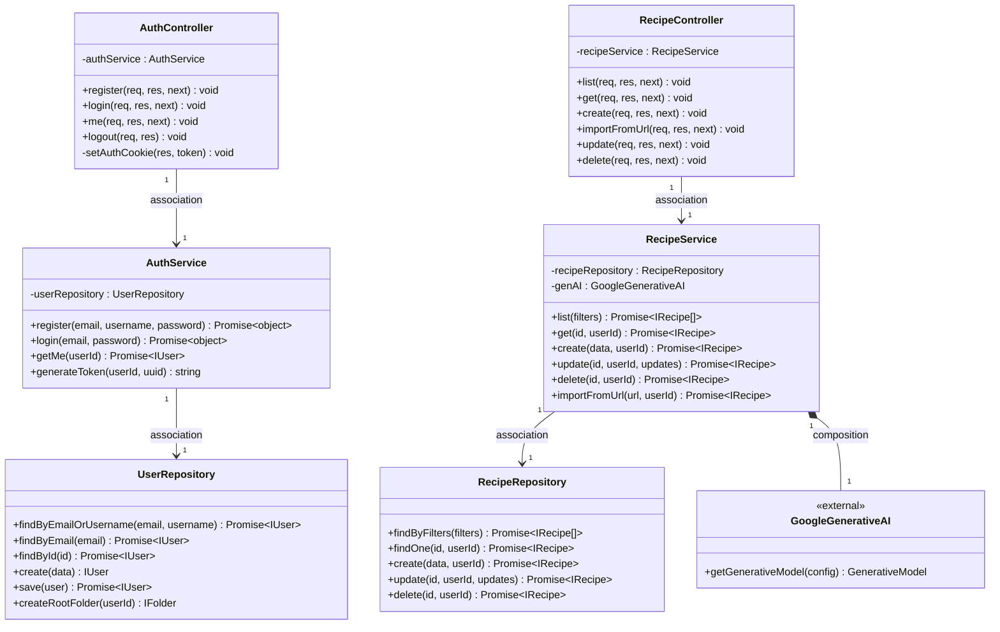
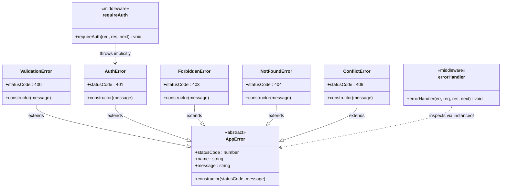
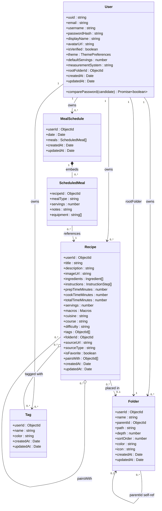
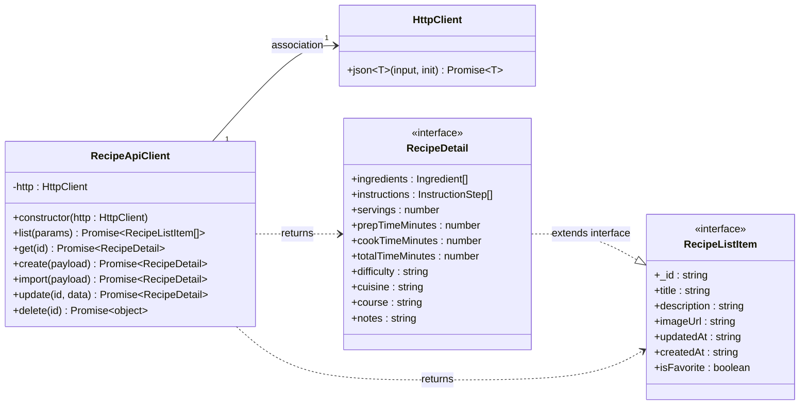

# DinnerParty — UML Class Diagrams

Static class diagrams showing class structure and structural associations across all layers of the system.

> **Association types used:**
> - `--|>` Inheritance (is-a)
> - `..|>` Realization (implements interface)
> - `*--` Composition (owns lifecycle)
> - `o--` Aggregation (references, does not own lifecycle)
> - `-->` Association (persistent reference)
> - `..>` Dependency (transient / throws / uses inline)

---

## 1. Backend Architecture

Three-layer backend showing how **Controllers**, **Services**, and **Repositories** structurally relate to each other. Controllers hold persistent associations to Services; Services hold persistent associations to Repositories. `RecipeService` composes `GoogleGenerativeAI` (it instantiates and owns it).

---

## 2. Error Hierarchy

`AppError` is the abstract base for all typed HTTP errors. Each subclass hard-codes its HTTP status code. `errorHandler` depends on `AppError` transiently via `instanceof` inspection.

---

## 3. Data Models

Mongoose document classes and their associations. `User` is the root aggregate — all other entities are scoped to a user. `Recipe` has optional associations to `Folder` and `Tag`. `MealSchedule` uses composition for embedded `ScheduledMeal` sub-documents. `Folder` is self-referential for its hierarchy.

---

## 4. Client Architecture

`HttpClient` is the base transport. `RecipeApiClient` is composed with an `HttpClient` instance via constructor injection. `RecipeDetail` extends `RecipeListItem`. Named function exports (e.g. `listRecipes`) delegate to the `recipeApiClient` singleton.

